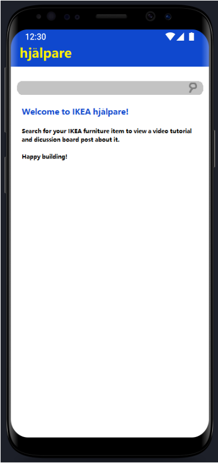
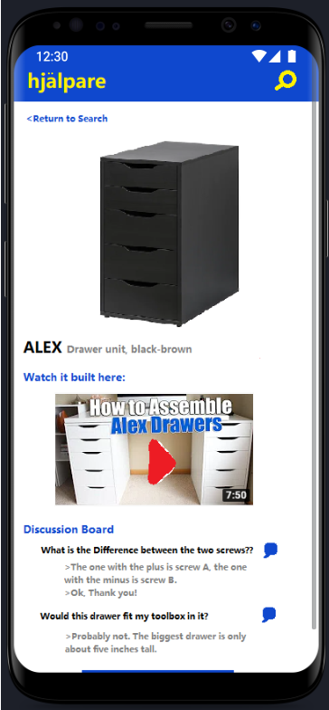
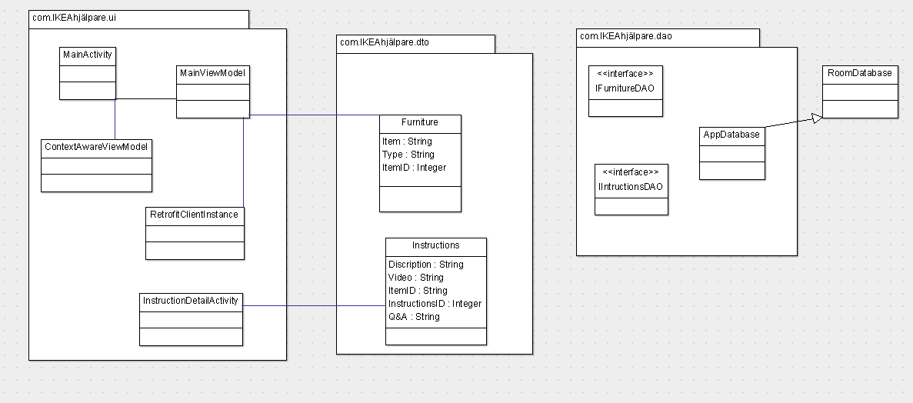

# IKEA-Hjalpare

Design Document

Taylor O’Black\
Puran Kansakar\
Chris Herman

## Introduction

Are your instructions for your new IKEA desk lacking in detail? Have you failed, time and time again, to attach the legs of your chairs the right way? Are you concerned about the large excess of screws you have once completing your new bed frame? IKEA hjälpare is here to be your helper!

With IKEA hjälpare, you can:
- View your furniture item as detailed in IKEA stores
- Watch a video tutorial for added visuals 
- Participate in a discussion board with fellow builders to ask any unanswered questions

## Storyboard

[Storyboard Invision App](https://invis.io/YGXI5WF289Q)

## Requirements

### Scenario
As an IKEA customer, I want access to more detailed instructions so that I can build my furniture relatively stress free and quickly. 

### Dependencies
Video tutorials are available for public access\ 
Ikea data is available 

### Assumptions
YouTube videos are public

### Example
**1.1 Given a feed of IKEA data is available**

When I search for “Alex”\
Then I should be directed to a page with a picture of the ALEX drawer and a discussion board for this item.

**1.2 Given feeds of IKEA and YouTube data are available**

When I search for “Malm”\
Then I should be directed to a page with a picture of the MALM bed frame, an embedded YouTube link for the building tutorial, and a 
discussion board post for this item.

**1.3 Given a feed IKEA is available**

When I search for “3478410”\
Then nothing should be returned in the search results.

## Class Diagram

### Class Diagram Description

**MainActivity:** This is the main page that the user will spend more time on. It is simple so that the user can just find what they need and get to building

**InstructionDetailsActivity:** This screen shows the video link to constructing the furniture along with its Q&A section

**RetrofitClientInstance:** Bootstrap class required for Retrofit.

**Furniture:** Noun class that represents the furniture.

**Intructions:** Noun class that represents Instructions.

**IFurnitureDAO:** Interface for Retrofit to find and parse Instructions JSON.

**IIntructionsDAO:** Interface for Room store Instructions data

## Scrum Board

[Scrum Board Link on GitHub](https://github.com/orgs/hjalpare/projects/1)

## Scrum Roles

DevOps/Product Owner/Scrum Master: Taylor O’Black\
Frontend Developer: Chris Herman\
Integration Developer: Puran Kansakar

## Weekly Meeting

Thursdays at 9 PM. Use this information to join: [https://discord.gg/hvKZNQ3]

